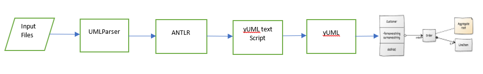
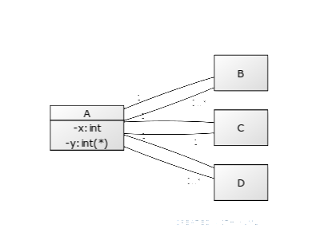
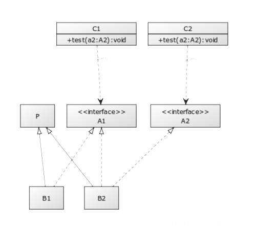
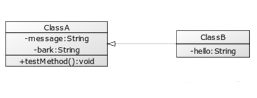
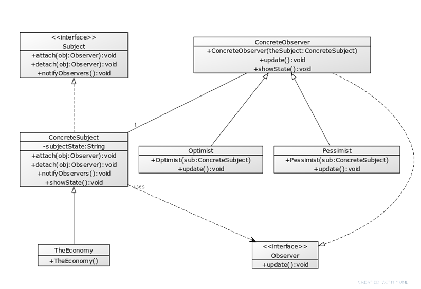
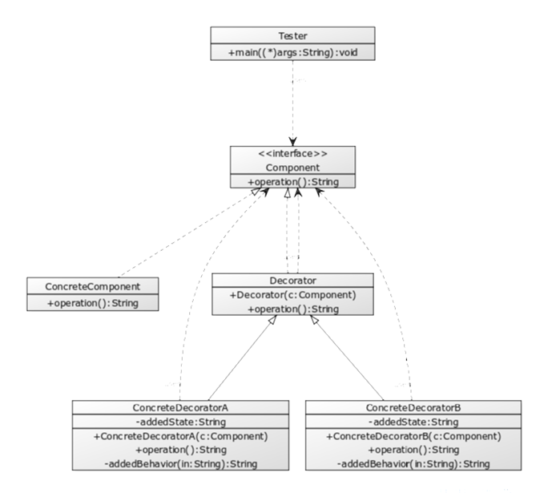

### UMLParser

#####Description: 
A Parser which converts Java Source Code into a UML class Diagram. Diagram generated is converted into a PNG format image which can be used in blogs, forums, bug-trackers and email.
The UML Parser takes input files in the folder containing classes and generates the output as class Diagram based upon input.
#####Tools used: 
Below tools are used:
1. ANTLR tool – ANTLR (Another tool for language Recognition) is a powerful parser generator for reading, processing, executing, or translating structured text or binary files. From a grammar, ANTLR generates a parser that can build and walk parse trees.

   I have used the grammar files “Java8Parser.g4” & “Java8Lexer.g4” for Java 8 from ANTLR GitHub resources for Java.  From the grammar, ANTLR tool generates the java classes consists of Parser, Lexer, Listener and Visitor to parse the Java code from the input files and generate the plain text script. 
   These java classes are placed in the folder umlparser\src\main\java.
   GitHub Link for grammar: https://github.com/antlr/grammars-v4/tree/master/java/java8.

2.	yUML – It is a web-based tool to build the UML Class Diagram by using the text scripts for UML. 

  The UMLParser creates the plain text script and send the Http request to yUML and generate the UML Diagram and save in png format.

#####Java Code Written by me
  For this project, I have written the Java code with class name UmlParser.java where ANTLR Listener class is used to parse Java code.
  UmlParser.java is placed in the folder umlparser\src\main\java

#####Instructions to run UMLParser
•	Go to folder umlparser\target and run umlparser.jar file using below instructions. Open terminal in folder and execute below commands.

cd umlparser\target

umlparser.jar  <source folder> <output file name>

umlparser.jar – UmlParser main class to execute the parser

source folder – Path to input java source files. In this project, we can use umlparser\default folder to keep java source files.

output file name – Path to output class diagram to be created. Please provide the “.png” extension in the end of file name in the path. For example, for test1 case, please provide output file name as umlparser\test1.png if UML diagram is required to be generated in umlparser folder.

umlparser.jar umlparser\default umlparser\test1.png

•	The diagram will be created in the path provided in output file name.

#####Test Diagrams created
Below are the images of 5 UML diagrams created by UmlParser project. 
The input files are in path umlparser\Test
The images are saved in path umlparser\umltestdiagram

Test1

Test2

Test3

Test4
 

Test5

 
